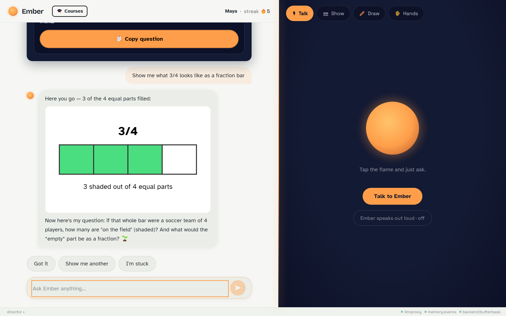
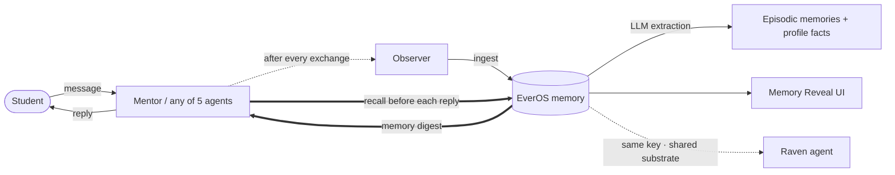
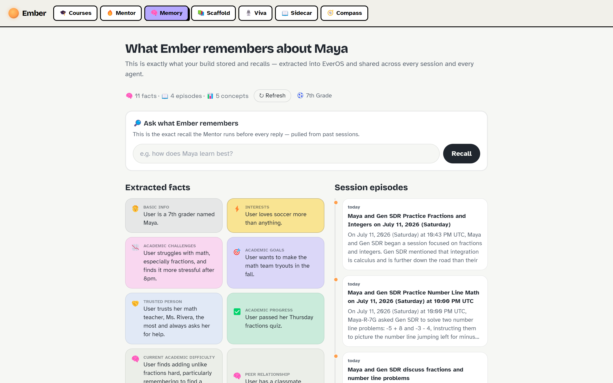
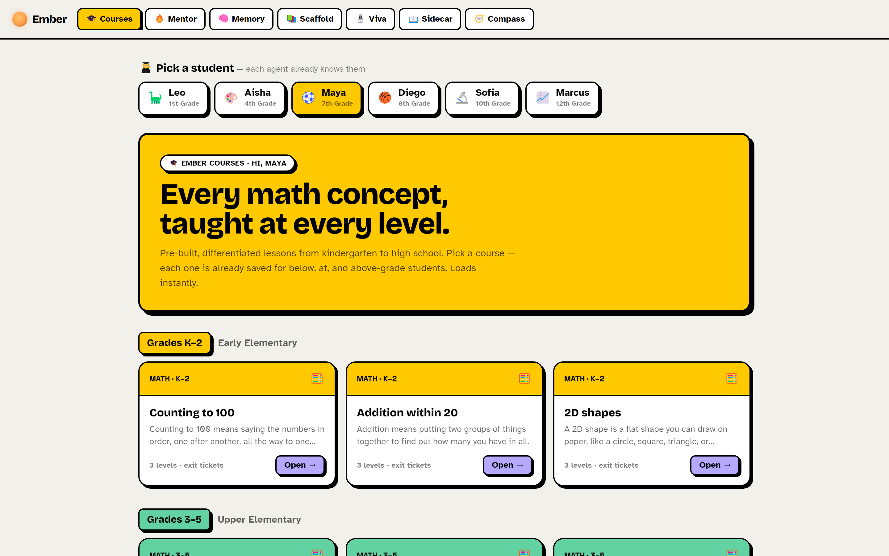
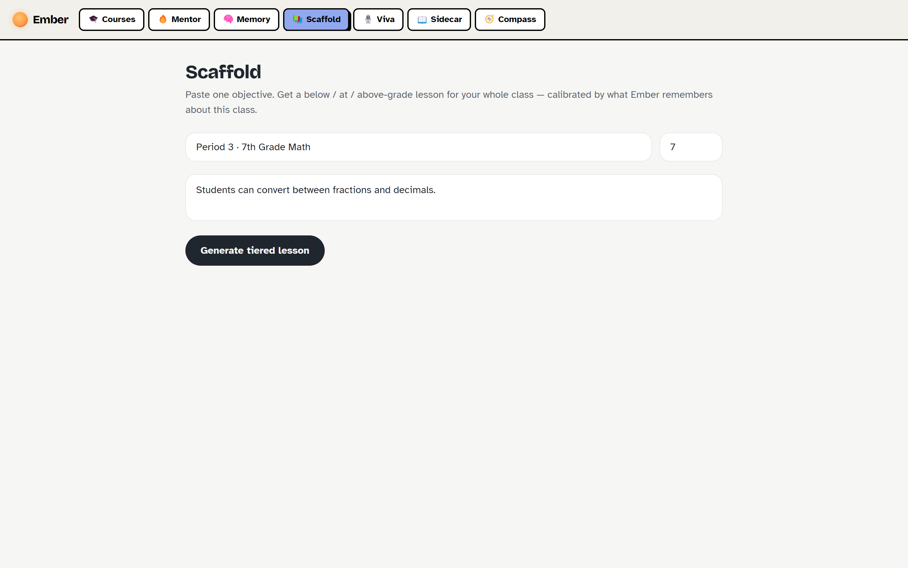
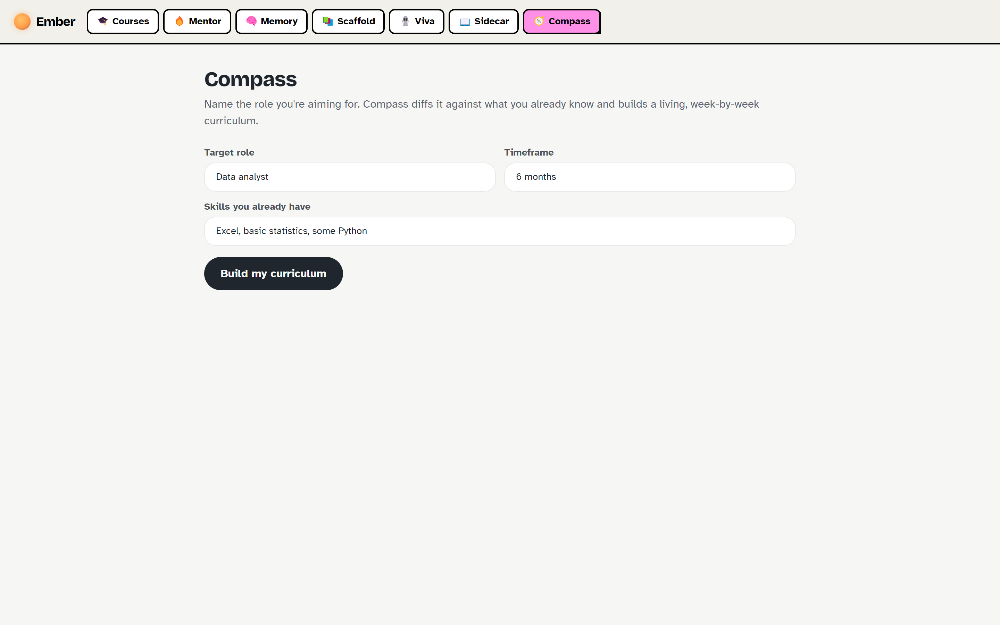
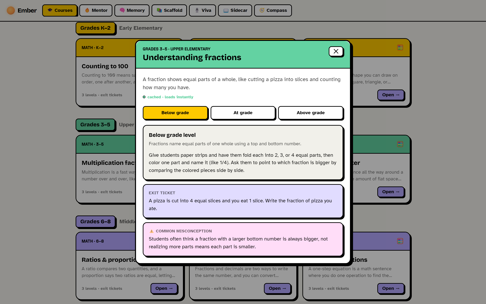
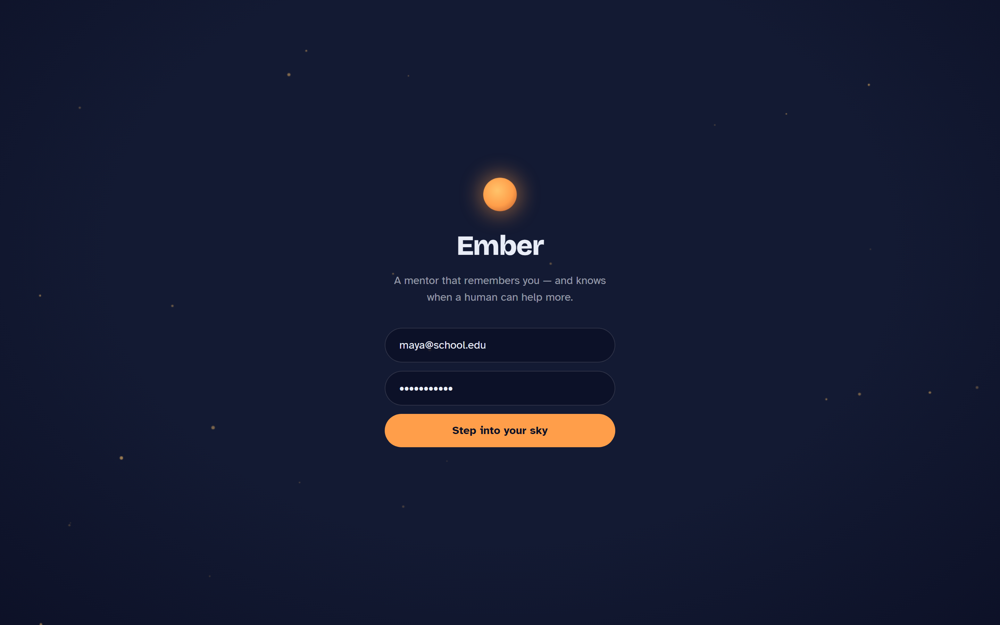
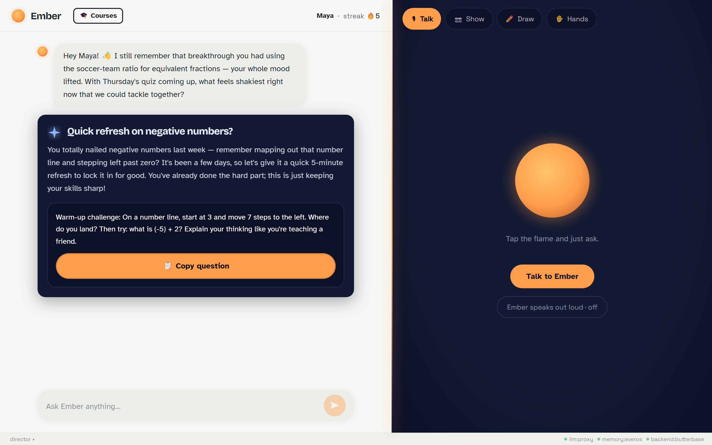

# 🔥 Ember — Relationship-Aware AI Learning Agent

> **Every AI tutor answers questions. Ember remembers you as a person — and knows when to hand you back to a human.**

Ember is a memory-first, self-learning tutoring agent. Unlike ordinary AI tutors that answer a question and forget you, Ember **learns each student as a person over time**, shows you exactly what it remembers, and knows when a teacher, parent, or classmate will help more than an AI.

**🌐 Live:** **[ember.butterbase.dev](https://ember.butterbase.dev)**

Built for the **AI for Education Hackathon @ Stanford** · track *Autonomous Learning Agents*.



---

## Why Ember

Stanford's Accelerator for Learning research says the crisis point of tech-heavy education is **relationships**, and that AI must *enhance* human connection, not replace it (Dan Schwartz's "Turing Trap"). Ember is built around that:

- **Visible, persistent memory** — powered by [EverOS](https://evermind.ai). You can literally open the memory and see what it stored.
- **A Connector agent** that routes learners back to humans at the right moments.
- **Self-learning** — it gets better with every session because it remembers.

---

## The self-learning loop

Ember runs three agents on every exchange:

| Agent | Role |
|---|---|
| **Mentor** | Warm, Socratic tutor. Gets a live memory digest; adapts to how each student learns. Replies with diagrams, images, videos, and animations. |
| **Observer** | After every message, extracts what changed (mastery, emotion, people, goals) and writes it to EverOS. |
| **Connector** | Deterministic rules decide when a human beats an AI, and drafts the hand-off. |

**LEARN → REMEMBER → ACT.** It learns you, remembers you across sessions, and acts on what it learned.

---

## 🧬 Powered by EverMind (EverOS)

Memory in Ember isn't a database table — it's **[EverOS](https://evermind.ai)**, EverMind's memory layer for agents. Ember feeds EverOS raw conversation; EverOS extracts durable **episodic memories** and a **student profile** (categorized facts, each with the evidence it was drawn from), which Ember recalls semantically before every reply. All five agents share the same memory, so learning in one carries to all.



Ember calls EverOS through a **Butterbase serverless function** (`/fn/everos`) so the API key never ships in the browser:

| Op | EverOS endpoint | Used by |
|---|---|---|
| `ingest` | `POST /api/v1/memories` | the Observer, after every exchange |
| `recall` | `POST /api/v1/memories/search` (hybrid) | every agent, before it replies |
| `dump`   | `POST /api/v1/memories/get` (episodic + profile) | the Memory Reveal view |
| `flush`  | `POST /api/v1/memories/flush` | force extraction at session end |

Seed history for all 6 students (K-12 → HS) is pre-ingested into EverOS, so recall is real from the very first interaction. Adapter: [`src/lib/everos.ts`](src/lib/everos.ts) · proxy: [`functions/everos.js`](functions/everos.js).

---

## 🧠 Memory Reveal — open the memory

A dedicated view shows *exactly* what Ember stored and recalls for each student, straight from EverOS: extracted **facts** (with the evidence quote), a **session-episode timeline**, **concept-mastery** bars, and a **live recall** box that runs the same search the Mentor does before every reply.



---

## 🏆 EverMind bounties — and how Ember solves each

### 🥇 Best Memory Reveal — *open the memory; show what your build stored and recalled*
The **Memory Reveal** tab (`#/memory`, screenshot above) opens EverOS directly: categorized **facts with their evidence quotes**, a **session-episode timeline**, **concept-mastery** bars, and a **live recall** box that runs the exact search the Mentor uses before every reply. It's not chat history — it's the durable understanding EverOS formed about the student, made visible.

### 🥇 Best Cross-Session Moment — *"because it remembered X, this time it did Y"*
Memory persists in EverOS across logins. Pick **Maya → Mentor**: it greets her referencing a *past* session ("the soccer-ratio trick that finally clicked"), then teaches today's topic *with a soccer analogy* — **because** it remembered soccer is how she learns. An early-session fact directly changes later-session behavior, live on screen.

### 🥇 Best Self-Evolving Memory — *change something mid-demo; let the agent adapt*
Mid-chat, change the signal — say *"this is way too easy, skip ahead,"* act bored, or give a couple of wrong answers. The **Observer** writes the change to EverOS and updates mastery in real time; hit **↻ Refresh** on the Memory Reveal and the new fact/episode is there. The memory visibly evolved from what the student just did — no redeploy, no reset.

### 🐦 Bonus — Build on Raven
[Raven](https://raven.evermind.ai) is EverMind's self-improving agent harness, built on the **same EverOS substrate** Ember uses. Because Ember writes memory to EverOS under stable learner ids (e.g. `maya-r-7g`), a Raven agent pointed at the same key **shares Ember's memory** — two different agents, one memory-first brain:

```bash
curl -fsSL https://raven.evermind.ai/install.sh | bash
export EVEROS_API_KEY=<the same key Ember uses>
raven agent -m "What do you remember about the student maya-r-7g?"
# → recalls the soccer / Ms. Rivera / math-team facts Ember stored
```

---

## One memory layer, five agents

Pick a student (K-12 → high school) and **every agent adapts its questions to them** — they all share one EverOS memory.



| Agent | What it does |
|---|---|
| 🔥 **Mentor** | 1:1 Socratic tutor with a live memory canvas + the Connector hand-off. |
| 📚 **Scaffold** | For teachers: one objective in, a below/at/above-grade lesson + exit tickets out, calibrated by what Ember remembers about the class. |
| 🎙️ **Viva** | Oral-exam-style assessment that maps mastery (no score) and never re-tests what you've shown. |
| 📖 **Sidecar** | Reshapes any reading for dyslexia, English learners, or focus needs; remembers each student's accommodations. |
| 🧭 **Compass** | Names a target career and builds a living weekly curriculum from live job-market data. |

<p float="left">
  
  
</p>

### Multimodal, multi-sensory chat

The Mentor replies with inline **SVG diagrams**, **AI-generated illustrations**, **real Google images & embeddable videos**, and **celebration animations with sound**. It also supports **voice** (talk to Ember) and **on-device vision** (show your homework, draw on a whiteboard, answer with your fingers via MediaPipe).



---

## Architecture

Ember is a React SPA deployed on Butterbase, with **every third-party API key kept server-side** inside Butterbase serverless functions — nothing sensitive ships in the browser bundle.

```
Browser (React + Vite + Tailwind)
  │
  ├── Butterbase Auth (JWT) ─────────── real email/password login
  ├── Butterbase Data API ───────────── transcripts + connector_events (Postgres)
  │
  └── Butterbase serverless functions (keys live here, not in the bundle):
        ├── /fn/claude  → Anthropic Claude  (Mentor / Observer / Connector / vision)
        ├── /fn/everos  → EverOS memory     (ingest / recall / flush / dump)
        └── /fn/tavily  → Tavily            (job search + real image/video media)
```

- **Butterbase** — auth, Postgres, 4 serverless functions, and one-command frontend hosting.
- **EverOS** — persistent episodic + profile memory across sessions and agents. *Also the substrate [Raven](https://raven.evermind.ai) is built on.*
- **Anthropic Claude** — reasoning across all agents (`claude-opus-4-8`).
- **Tavily** — live web/job/image/video search.

The whole app also runs **fully on local mocks with zero credentials** — every integration lives behind an adapter (`src/lib/*.ts`) and degrades gracefully.

---

## Tech stack

- **Frontend:** React 18, Vite, TypeScript, Tailwind CSS, Zustand
- **Visuals:** d3-force (memory canvas), inline SVG, MediaPipe Tasks Vision (hands/face), Web Audio, Web Speech
- **Backend / infra:** Butterbase (auth, Postgres, functions, hosting)
- **Memory:** EverOS
- **LLM:** Anthropic Claude · **Search/media:** Tavily

---

## Run it locally

```bash
npm install
npm run dev        # http://localhost:5173  (runs on mocks with no keys)
npm run build      # production build → dist/
```

Drop credentials into `.env` (see `.env.example`) to go live. With just a Butterbase app id, auth + data + all three proxy functions come online; add EverOS / Anthropic / Tavily keys to the function envs (kept server-side).

```env
VITE_BUTTERBASE_APP_ID=app_xxxxxxxx     # turns on real auth + data + functions
# LLM / memory / search keys live in the Butterbase function envs, not the bundle
```

---

## Project structure

```
src/
  lib/
    config.ts      env + mode detection (live vs mock per layer)
    llm.ts         Claude client (streaming + JSON) via the /fn/claude proxy
    everos.ts      EverOS memory client (ingest / recall / dump)
    tavily.ts      job search  ·  serp.ts  media (images/videos)
    memory.ts      per-student structured memory graph
    connector.ts   deterministic Connector rules
    store.ts       Zustand — orchestrates the whole loop
  components/       Chat, Message, RichMessage (media), ConnectorCard, Canvas, …
  modes/            Home, MemoryReveal, Scaffold, Viva, Sidecar, Compass
  data/             students.ts (K-12 → HS roster), precache.json (cached lessons)
functions/          Butterbase serverless functions: claude, everos, tavily, serp
```

---

## Screenshots

| Login | Mentor + memory canvas |
|---|---|
|  |  |

---

## Credits

Built by **[Kush](https://www.linkedin.com/in/kush-ise/)** for the AI for Education Hackathon @ Stanford.

Powered by **Butterbase**, **EverOS**, **Anthropic Claude**, and **Tavily**.

> Every AI tutor answers questions. Ember knows when to hand you back to a human.
